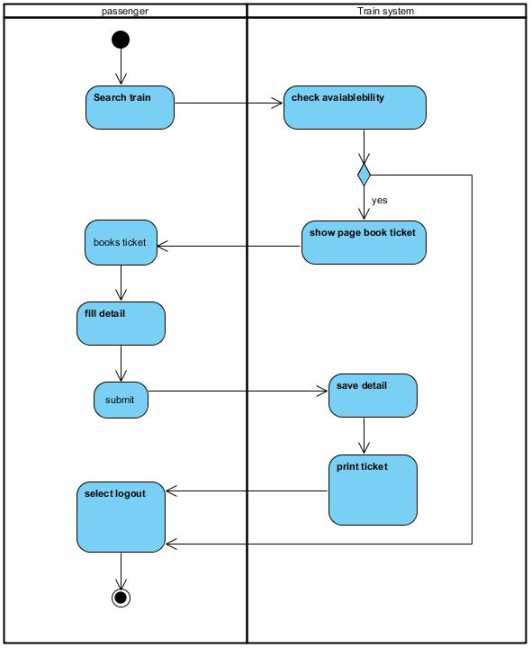
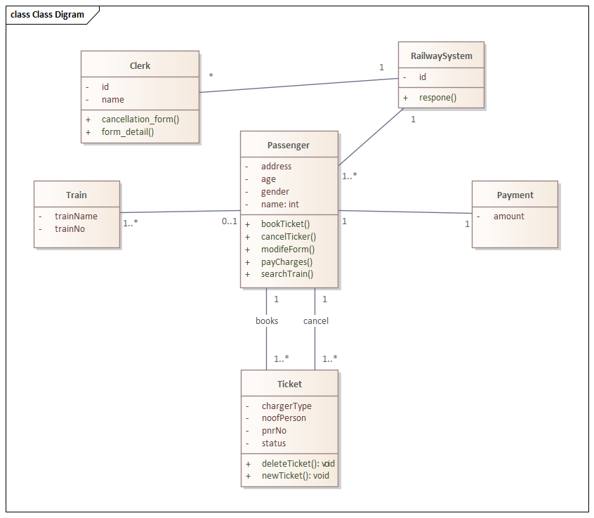
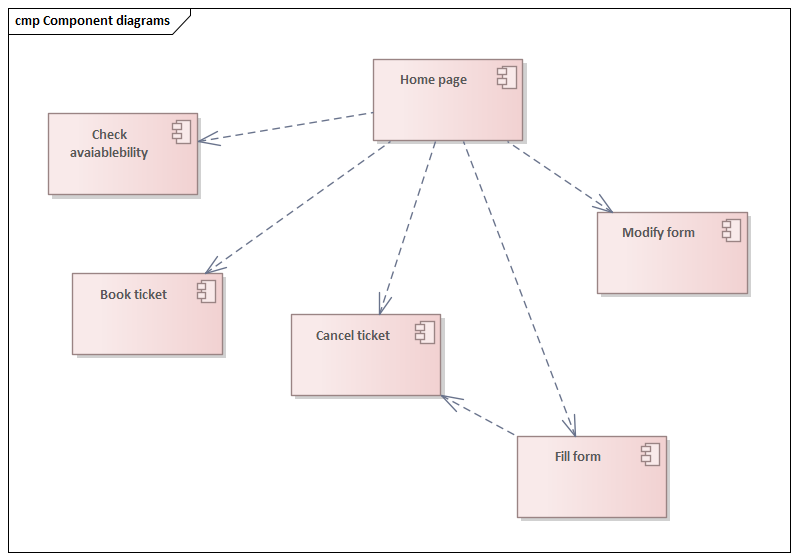
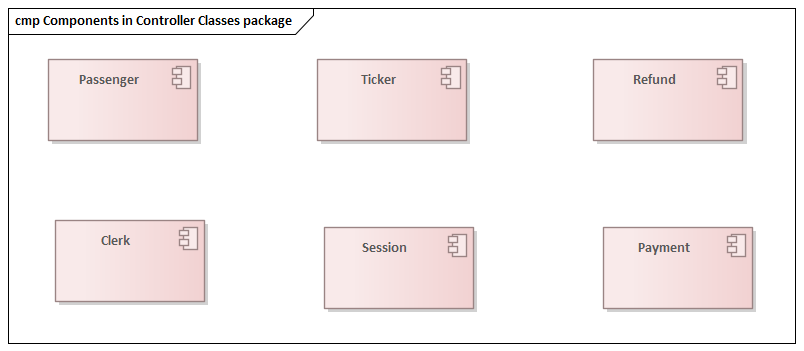
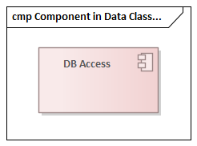
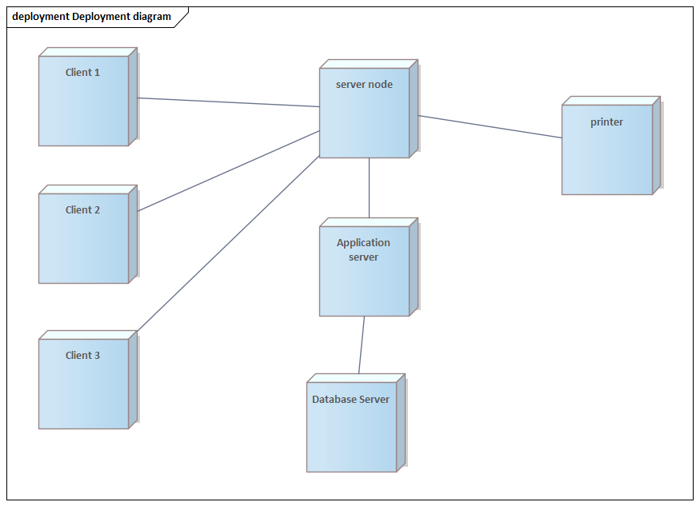
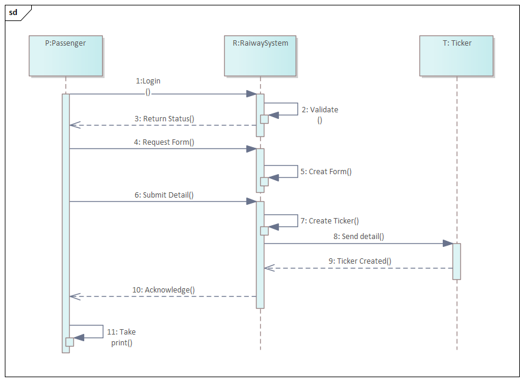
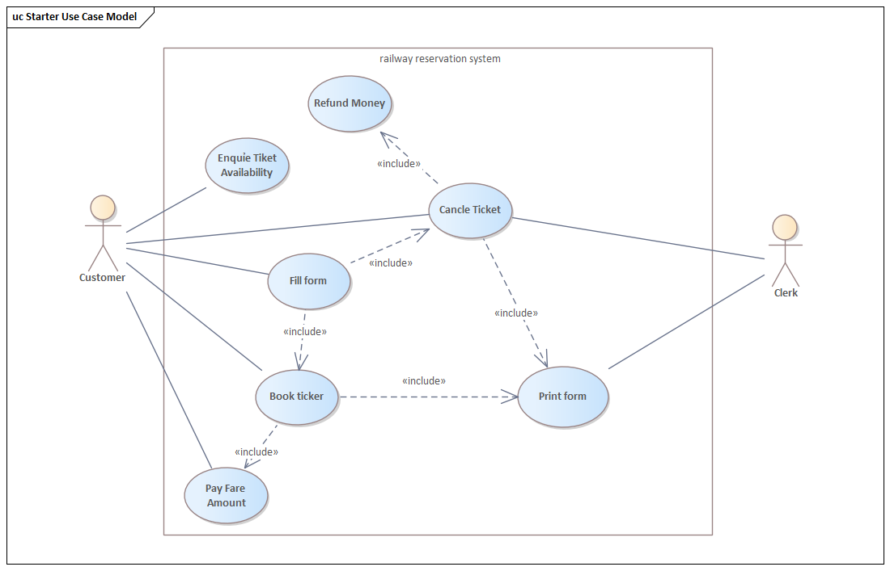

# 
 Software Architecture And Design Pattern 

---

# 
 Content of Weekly Exercises

-   [Week 01](#week-01)
-   [Updating...](#updating)

---

## Week 01 {#week-01}

### UML diagrams for railway reservation system

**[exercises - UML diagrams for ATM application.pdf](/Tuan01/exercises%20-%20UML%20diagrams%20for%20ATM%20application.pdf)**

#### Activity Diagram

    

#### Class Diagram

    

#### Components in View Classes Package

    

#### Components in Controller Classes Package

    

#### Component in Data Classes Package

    

#### Deployment Diagram

    

#### Sequence Diagram

    

#### Use Case Model

    

---

    <footer>
        Nguyễn Văn Vũ - 20002865
    </footer>

